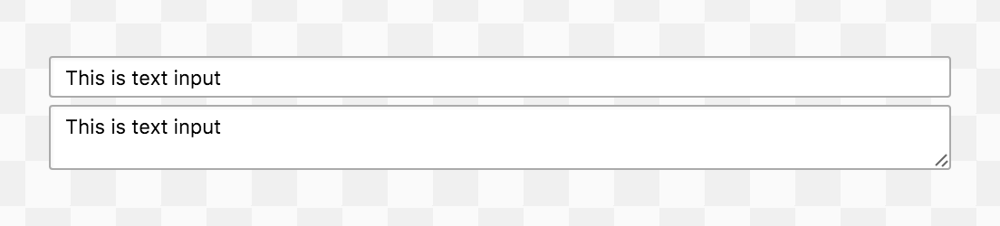

apeman-react-text
==========

<!---
This file is generated by ape-tmpl. Do not update manually.
--->

<!-- Badge Start -->
<a name="badges"></a>

[![Build Status][bd_travis_shield_url]][bd_travis_url]
[![Code Climate][bd_codeclimate_shield_url]][bd_codeclimate_url]
[![Code Coverage][bd_codeclimate_coverage_shield_url]][bd_codeclimate_url]
[![npm Version][bd_npm_shield_url]][bd_npm_url]
[![JS Standard][bd_standard_shield_url]][bd_standard_url]

[bd_repo_url]: https://github.com/apeman-react-labo/apeman-react-text
[bd_travis_url]: http://travis-ci.org/apeman-react-labo/apeman-react-text
[bd_travis_shield_url]: http://img.shields.io/travis/apeman-react-labo/apeman-react-text.svg?style=flat
[bd_license_url]: https://github.com/apeman-react-labo/apeman-react-text/blob/master/LICENSE
[bd_codeclimate_url]: http://codeclimate.com/github/apeman-react-labo/apeman-react-text
[bd_codeclimate_shield_url]: http://img.shields.io/codeclimate/github/apeman-react-labo/apeman-react-text.svg?style=flat
[bd_codeclimate_coverage_shield_url]: http://img.shields.io/codeclimate/coverage/github/apeman-react-labo/apeman-react-text.svg?style=flat
[bd_gemnasium_url]: https://gemnasium.com/apeman-react-labo/apeman-react-text
[bd_gemnasium_shield_url]: https://gemnasium.com/apeman-react-labo/apeman-react-text.svg
[bd_npm_url]: http://www.npmjs.org/package/apeman-react-text
[bd_npm_shield_url]: http://img.shields.io/npm/v/apeman-react-text.svg?style=flat
[bd_standard_url]: http://standardjs.com/
[bd_standard_shield_url]: https://img.shields.io/badge/code%20style-standard-brightgreen.svg

<!-- Badge End -->


<!-- Description Start -->
<a name="description"></a>

apeman react package for text component.

<!-- Description End -->


<!-- Overview Start -->
<a name="overview"></a>


<!-- Overview End -->


<!-- Sections Start -->
<a name="sections"></a>

<!-- Section from "doc/guides/01.Installation.md.hbs" Start -->

<a name="section-doc-guides-01-installation-md"></a>
Installation
-----

```bash
$ npm install apeman-react-text --save
```


<!-- Section from "doc/guides/01.Installation.md.hbs" End -->

<!-- Section from "doc/guides/02.Demo.md.hbs" Start -->

<a name="section-doc-guides-02-demo-md"></a>
Demo
-----

[Live demo][demo_url] is hosted on GitHub Pages.

[][demo_url]

[demo_url]: http://apeman-react-labo.github.io/apeman-react-text/demo/demo.html


<!-- Section from "doc/guides/02.Demo.md.hbs" End -->

<!-- Section from "doc/guides/03.Usage.md.hbs" Start -->

<a name="section-doc-guides-03-usage-md"></a>
Usage
---------

```jsx
'use strict'

import React from 'react'
import {ApText, ApTextStyle} from 'apeman-react-text'

const ExampleComponent = React.createClass({
  render() {
    return (
      <div>
        <ApTextStyle />
        <ApText name="username"
                value="AIUEO"
                onChange={ (e) => console.log(e.target.value) }
        />
      </div>
    )
  }
})

```


<!-- Section from "doc/guides/03.Usage.md.hbs" End -->

<!-- Section from "doc/guides/04.Components.md.hbs" Start -->

<a name="section-doc-guides-04-components-md"></a>
Components
-----


### ApTextStyle

**Props**

| Name | Type | Default | Description |
| ---- | ---- | ------- | ----------- |
| type | string | &#x27;text/css&#x27; | |  |
| style | object | {} | |  |
| highlightColor | string | ApStyle.DEFAULT_HIGHLIGHT_COLOR | |  |
| maxWidth | number | ApStyle.CONTENT_WIDTH | |  |

### ApText

**Props**

| Name | Type | Default | Description |
| ---- | ---- | ------- | ----------- |
| name | string | &#x27;&#x27; | | Name of text input |
| value | string | &#x27;&#x27; | | Value of text input |
| placeholder | string | &#x27;&#x27; | | Placeholder text |
| rows | number | 1 | | Number of rows |
| candidates | arrayOf | null | | Selectable candidate text |


<!-- Section from "doc/guides/04.Components.md.hbs" End -->


<!-- Sections Start -->


<!-- LICENSE Start -->
<a name="license"></a>

License
-------
This software is released under the [MIT License](https://github.com/apeman-react-labo/apeman-react-text/blob/master/LICENSE).

<!-- LICENSE End -->


<!-- Links Start -->
<a name="links"></a>

Links
------

+ [apeman](https://github.com/apeman-labo/apeman)
+ [apeman-react-labo](https://github.com/apeman-react-labo)
+ [React](https://facebook.github.io/react/)

<!-- Links End -->
